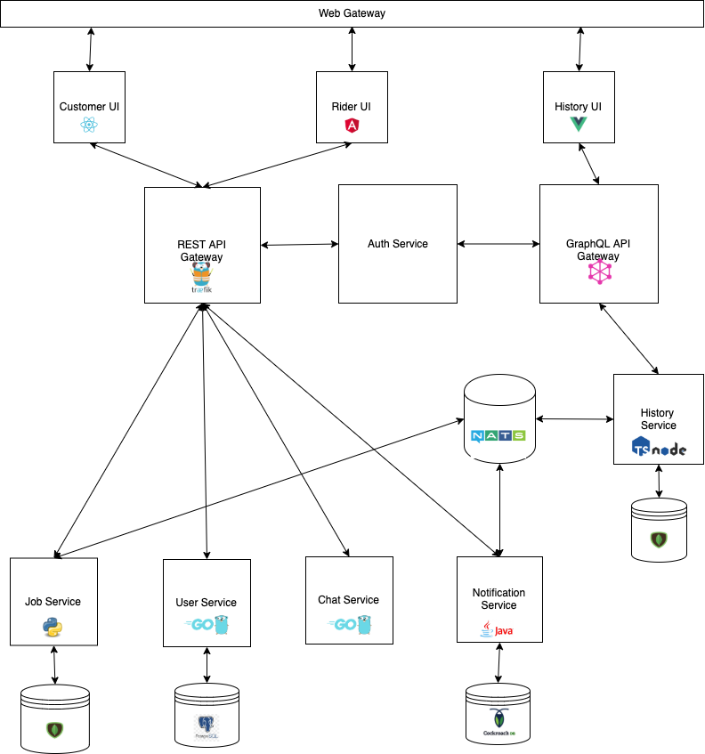

# Summary 
A demo application showing microservices

# Problem
- Customers today have a lot tasks they do not have the man power to accomplish, therefore they are willing to designate a lot of this tasks to private contractors and riders.
- This solution will focus on the *rider* niche, it will provide a market place to find riders and manage the job assigned to a rider.
- Help riders run a more efficient business
- Drive more customers to rider services

# Solution
- [ ] Allow Customers to explore options for Riders 
- [ ] Allow Customers to send job request to Riders
- [ ] Rider can accept/decline job
- [ ] Customers can track job status
- [ ] Customers and Riders can chat through a messaging system
- [ ] Customers can manage job history
- [ ] Riders can manage job history

# Glossary
- `Customer` is an individual or business owner looking for a rider to comlete a job 
- `Rider` is a qualified individual that can deliver and pick up packages for customers
- `Job` an open ended task that needs to be completed by the customer e.g. A customer wants to deliver a package to his client across the city

# Out of Scope
- No payment feature
- No data encryption
- Minimal Authentication

# Assumptions
- All riders are vetted and trusted
- All jobs are within one city or a single geographical area
- Riders can only do one job at a time

# Solution
## Customer 
- [ ] Explore and find riders
- [ ] Create a job request
- [ ] Track an accepted and ongoing job request
- [ ] Chat with riders through 
- [ ] Manage job history
- [ ] Rate the riders service
- [ ] Update my account information

## Riders 
- [ ] Get notified on job request
- [ ] Accept or Decline job
- [ ] View assigned and accepted jobs 
- [ ] Start and finish an accepted job
- [ ] Manage job history
- [ ] Update my account information

# User Flow
## Customer
1. Signup
    - Name
    - Address
    - Phone 
2. Explore riders
    - Find riders 
    - Filter riders by available options
3. Create a job request
    - Job description
    - Package description
    - Pick up address
    - Destination address
    - Status
4. Track jobs
    - Get live status update on the job
5. Update my account information
    - Name
    - Address
    - Phone 
6. Manage previous jobs
7. Rate riders

## Riders
1. Signup
    - Name
    - Address
    - Phone 
2. Get notified when job requests are made
    - Can only complete one job request at a time
3. Accept or Decline job
4. Update current job
    - Update live status of job at hand
5. Update my account information
    - Name
    - Address
    - Phone 
6. Manage previous jobs
7. Rate customers

# Architecture

  

 
# Stack & Tools
- [ ] Containers [Docker & Docker-Compose](https://www.docker.com/)
- [ ] Container Orchestration [Kubernetes](https://kubernetes.io/)
- [ ] CI for Kubernetes-native applications [skaffold](https://skaffold.dev/)
- [ ] Customer UI [React](https://reactjs.org/)
- [ ] Rider UI [Angular](https://angular.io/)
- [ ] Job History [Vue](https://vuejs.org/)
- [ ] Web gateway [Nginx](https://www.nginx.com/)
- [ ] Rest API Gateway [Traefik](https://containo.us/traefik/)
- [ ] GraphQL API Gateway [GraphQL](https://graphql.org/)
- [ ] Message Broker [NATS](https://nats.io/)
- [ ] Caching [Redis](https://redis.io/)
- [ ] Web Sockets [Socket io](Socket.io)
- [ ] Search Engine [Elastic Search](https://www.elastic.co/)
- [ ] Load Generator [Python](https://locust.io/)
- [ ] RPC [gRPC](https://grpc.io/)
- [ ] Material UI [Angular](https://material.angular.io/)
- [ ] Material UI [React](https://material-ui.com/)
- [ ] Material UI [Vue](https://vuematerial.io/components/app)

# Services
- [ ] `Customer UI` (React, material-ui, Docker)
    - [ ] Signup
    - [ ] Login
    - [ ] Explore and find riders
    - [ ] Create jobs
    - [ ] Assign jobs to riders
    - [ ] List jobs
    - [ ] Delete job
    - [ ] Update job
    - [ ] List notifications
    - [ ] Chat messenger
    - [ ] List job history

- [ ] `Rider UI` (Angular, material-ui, Docker)
    - [ ] Signup
    - [ ] Login
    - [ ] List my jobs
    - [ ] Update job status
    - [ ] List notifications
    - [ ] Chat messenger
    - [ ] List job history

- [ ] `History UI` (Vue, material-ui, Docker)
    - [ ] Signup
    - [ ] Login
    - [ ] List my jobs
    - [ ] Update job status
    - [ ] List notifications
    - [ ] Chat messenger
    - [ ] List job history

- [ ] `REST API Gateway` (Traefik, Docker)
    - [ ] It receives requests on behalf of the system and finds out which components are responsible for handling them.

- [ ] `Job` (REST, MongoDB, Python, Docker)
    - [ ] Create job
    - [ ] Get job
    - [ ] Delete job
    - [ ] Update job

- [ ] `Auth` (REST, gRPC, Python, Docker)
    - [ ] Generate user token for app access
    - [ ] Renew user tokens for app access
    - [ ] Check if token is valid

- [ ] `User` (REST, Postgresql, Go, Docker)
    - [ ] Sign up
    - [ ] Login
    - [ ] Get user
    - [ ] Delete user
    - [ ] Update user

- [ ] `Chat` (Web-Socket, Go, Docker)
    - Creates rooms for users to chat

- [ ] `Notification` (REST, Message Broker, CockroachDB, JAVA, spring, Docker)
    - [ ] Create notification 
    - [ ] Delete notification

- [ ] `History` (GraphQL, NodeJS, Typescript, Docker)
    - [ ] Get job history for Riders and Customers
    - [ ] Get notifications created linked to a job 

